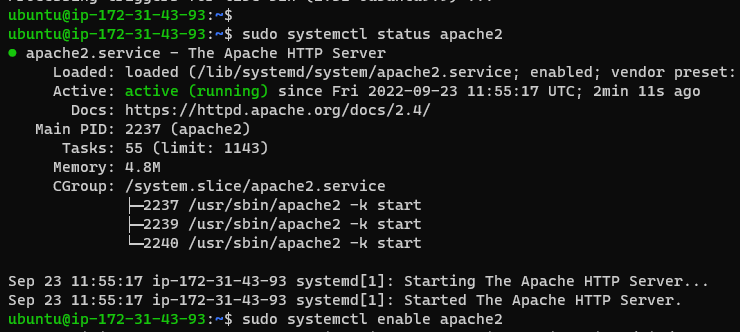

## documentation of project1

`sudo apt update`

`sudo apt install apache2`

`sudo systemctl apache2`

. [install openssh](https://www.techrepublic.com/article/how-to-install-the-openssh-server-on-windows-with-powershell/)

. [openssh key management](https://learn.microsoft.com/en-us/windows-server/administration/openssh/openssh_keymanagement)